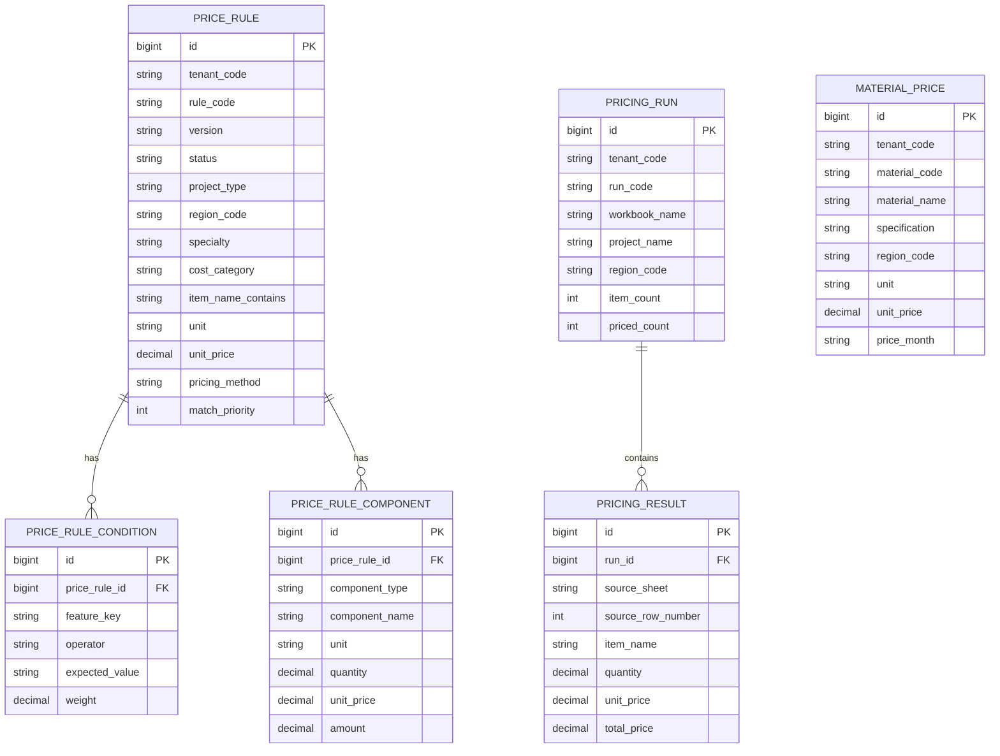

# 企业级数据模型

## 核心实体

## 为什么这样拆

`price_rule` 保存规则主数据，适合做版本、租户、地区、专业、状态管理。

`price_rule_condition` 保存项目特征匹配条件，适合做索引、统计和规则治理。例如可以快速回答“哪些规则依赖桩型”“哪些规则需要 C80”。

`price_rule_component` 保存综合单价组成，后续可以扩展为人工费、材料费、机械费、管理费、利润、税金等明细。

`material_price` 保存材料信息价，后续可按地区和月份接入政府信息价、供应商报价或企业采购价。

`pricing_run` 和 `pricing_result` 保存审计结果，确保每一次计价都有批次、规则版本和逐条结果追溯。

## 后续演进

1. 增加规则命中索引：按 `tenant_code + region_code + specialty + unit + feature_key` 预筛候选规则。
2. 定额子目自动展开为 `price_rule_component`。
3. 增加材料价供应商优先级和地区调差。
4. 增加规则版本 diff 和组成价审批记录。
5. 增加 API 自动化测试和前端端到端测试。
